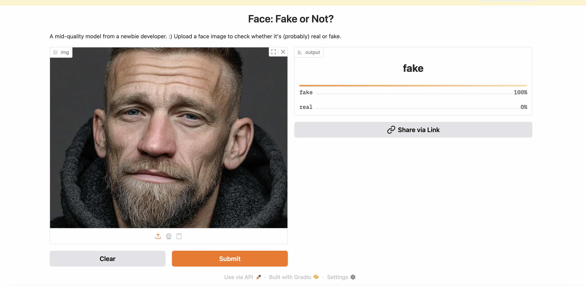

# face-fake-or-not-v1

A ResNet50-based image classifier fine-tuned on real and AI-generated faces using FastAI.

This project explores training an image classifier model to determine whether an image of a human face is real or AI-generated ("fake"). It's built using the [FastAI](https://www.fast.ai) library, which simplifies deep learning workflows while leveraging PyTorch under the hood. This version uses a ResNet50 backbone, trained and fine-tuned across progressively harder datasets. I adapted a version of the model in the FastAI Practical Deep Learning for Coders designed for categorizing images of grizzly bears, brown bears, and teddy bears.

This was my first effort at training and fine-tuning a model from start to finish and deploying it on Hugging Face. The model is reasonably accurate on older generation fake images, but appears to have a tendency to categorize as "real" images created with the latest generation tools, particularly if they replicate "studio settings" with an apparent narrow depth of focus.

All training was done locally on an M3 Macbook Pro. 

Further development could include: 
    1.  Training on more images (perhaps using a cloud-based service with GPU access)
	2.	Starting with a pretrained model with greater capacity (such as ResNet101, a transformer-based model like ViT, or one pretrained specifically for detecting fake/synthetic content)
	3.	Enhancing the dataset with hard negatives or adversarial examples to improve robustness
	4.	Adding explainability tools (e.g., Grad-CAM) to visualize what parts of the image influence predictions
	5.	Improving the Gradio UI for example with batch uploading.

---

### Data

The model was first trained using ~3,000 "fake" images and ~3,000 "real" images from Kaggle's 140k Real and Fake Faces dataset @ https://www.kaggle.com/datasets/xhlulu/140k-real-and-fake-faces.

Fine-tuning was done on images from The "This Person Does Not Exist" Random Face Generator @ https://this-person-does-not-exist.com/en and images downloaded from social media and images crated via MidJourney.

---

### Demo

Here's an example of the model in action, hosted on [Hugging Face Spaces](https://huggingface.co/spaces/BA-Baracus/face_fake_or_not_v1):



---

### Model Evolution & Performance

The model went through multiple rounds of fine-tuning. Here is the performance on a hard set of real and fake images:

| Round     | Real Accuracy | Fake Accuracy |
|-----------|---------------|----------------|
| Round 0   | 98.0%         | 5.6%           |
| Round 1   | 51.3%         | 79.6%          |
| Round 2   | 92.2%         | 55.6%          |

- **Round 0** struggled badly in identify fake images.
- **Round 1** was tuned on very hard fakes, causing a drop in real accuracy.
- **Round 2** attempted to balance both, yielding improved performance on both.

---

### Built With

- Python + FastAI
- PyTorch
- Gradio (for the demo UI)
- Hugging Face Spaces (for deployment)

---

### Try It Yourself

👉 [Launch the demo on Hugging Face](https://huggingface.co/spaces/BA-Baracus/face_fake_or_not_v1)

Or clone the repo and run locally:

<pre><code>```bash
git clone https://github.com/bruce-antley/face-fake-or-not-v1.git
cd face-fake-or-not-v1
```</code></pre>


⸻
### Model Info

This app uses a FastAI-trained binary classifier that predicts whether a face is real or AI-generated.

The model is hosted on Hugging Face:
👉 round2_final.pkl

To load it in Python:

from huggingface_hub import hf_hub_download
from fastai.learner import load_learner

model_path = hf_hub_download(
    repo_id="BA-Baracus/face-fake-or-not-v1",
    filename="round2_final.pkl"
)

learn = load_learner(model_path)


⸻

### License

This project is licensed under the MIT License.

